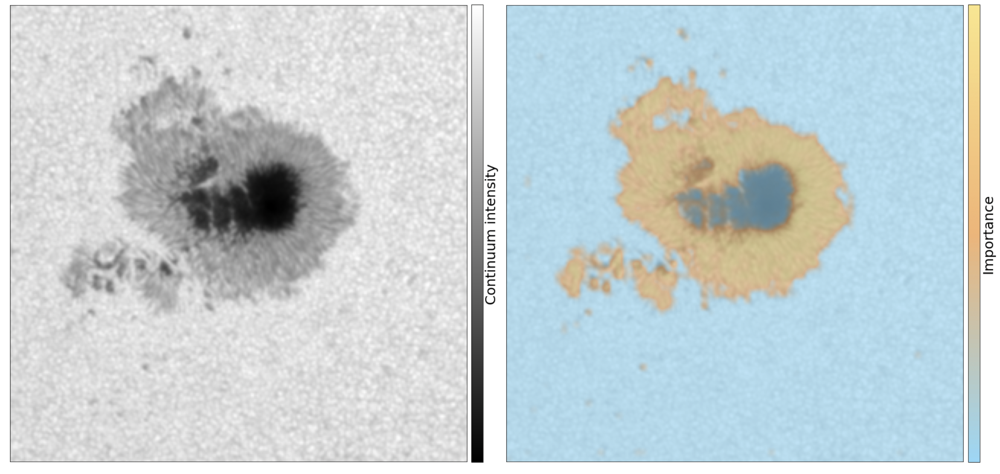

# NASA ML
**This repo contains several applications of ML algorithms to NASA's IRIS and SDO satalites.**
Here I provide a few toy examples of: 
- Grad-CAM to find the discriminant region between Sunspots and pores from SDO data.
- MINE-network for the calculation of mutule infomation between IRIS spectral lines
- t-SNE to find a two-dimensional embedding of solar spectra from an active and quite Sun. 

**Figure 1** — Atmospheric stratification inferred by the normalizing flow for two examples. In each column, the orange solution is inferred only using the Fe I line while the brown solution also uses the Ca II profile. The lowest row shows the original intensity values together with the synthetic calculation from the maximum posterior solution.